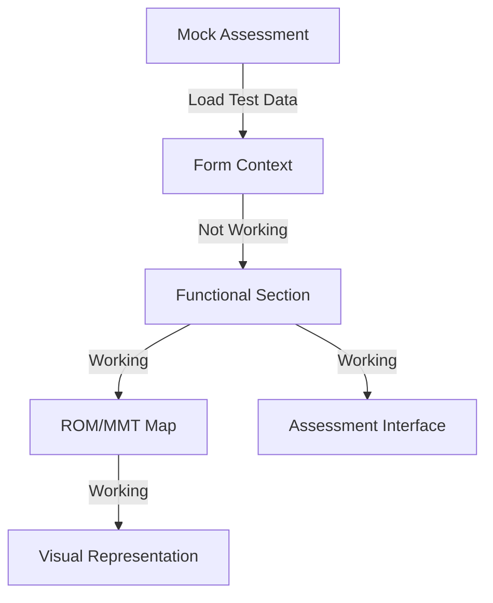

# Assessment System Integration Progress

## ✅ Core Integration Status
Recent implementations:
- ✅ Save/Load functionality complete
- ✅ Report generation button integrated
- ✅ Progress dialog implemented
- ✅ Data validation system working
- ✅ Body map integration completed
- ✅ Symptoms mapping system working
- ✅ ROM/MMT visual assessment integrated

### Completed Components
1. ✅ Initial Section
2. ✅ Medical Section
3. ✅ Symptoms Section
   - Body map visualization
   - Pain severity tracking
   - Symptom details capture
4. ✅ Typical Day Section
   - Pre/post accident comparison
   - Daily routines
   - Weekly schedules
5. 🟡 Functional Section
   - ✅ ROM/MMT body map interface
   - ✅ Interactive assessment system
   - ❌ Test data not populating correctly
   - ✅ Visual findings summary
6. ✅ Environmental Section
7. ✅ ADL Section
8. ✅ Care Section
9. ✅ AMA Section

### Current Limitations & Issues
1. 🟡 Functional Assessment Data
   - Test data not rendering in functional section
   - ROM/MMT values not loading from mockAssessment
   - Form structure working but empty

### Next Critical Steps

1. Data Integration Fixes
   - Fix test data population in functional section
   - Verify data structure matches between form and mockAssessment
   - Add validation for ROM/MMT inputs

2. Body Map Enhancement
   - ✅ Anatomically correct proportions
   - ✅ Core muscle group focus
   - ✅ Proper joint positioning
   - ✅ Bilateral assessment support

3. Data Validation
   - Add edge case handling
   - Improve error messaging
   - Add data type validation

## Technical Notes

### Form Structure
```typescript
interface FunctionalAssessmentData {
  capacities: FunctionalCapacity[];
  rom: Record<string, ROMAssessment>;
  mmt: Record<string, MMTAssessment>;
  overallNotes: string;
  recommendedAccommodations: string[];
  followUpNeeded: boolean;
  followUpNotes?: string;
}
```

### Current Data Flow


## Next Steps
1. Debug test data loading in functional section
2. Verify form context data structure
3. Add data validation for ROM/MMT inputs
4. Complete remaining section implementations
5. Add comprehensive error handling

## Documentation
All components are documented in their respective files with TypeScript types. Key areas requiring attention are marked with TODO comments.